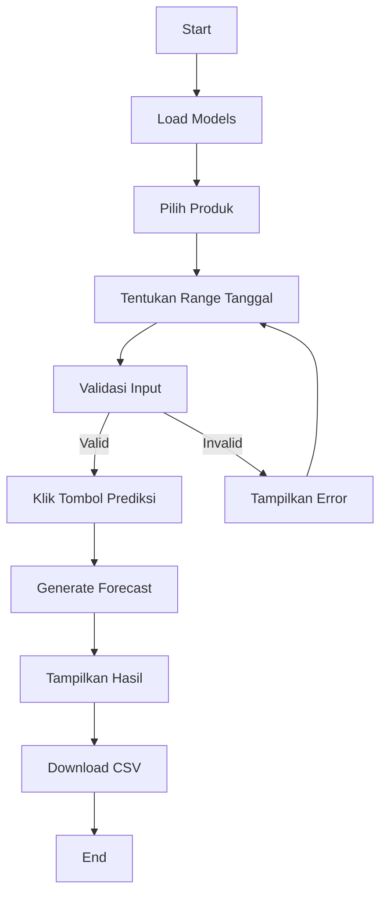
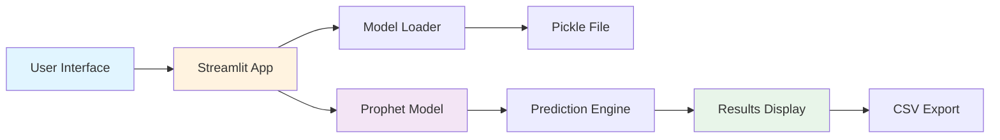
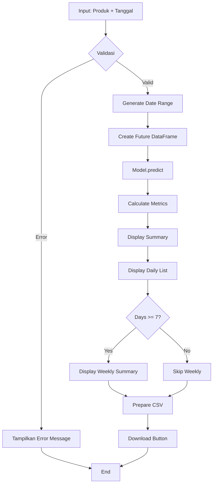

# Prediksi Penjualan - Dokumentasi

## Deskripsi

Aplikasi prediksi penjualan berbasis Streamlit yang menggunakan model Prophet untuk melakukan forecasting penjualan produk. Aplikasi ini menyediakan interface sederhana untuk memilih produk, menentukan range tanggal, dan mendapatkan prediksi penjualan harian.

## Fitur Utama

- **Pemilihan Produk**: Pilih produk dari daftar lengkap dengan fitur pencarian
- **Prediksi Multi-Hari**: Generate prediksi untuk range tanggal tertentu
- **Ringkasan Statistik**: Total prediksi, rata-rata, minimum, dan maksimum
- **Detail Per Hari**: List lengkap prediksi untuk setiap hari
- **Ringkasan Mingguan**: Agregasi data per minggu (untuk range >= 7 hari)
- **Export CSV**: Download hasil prediksi dalam format CSV
- **Informasi Model**: Metrik akurasi model (MAPE, MAE)
- **Data Historis**: Statistik dan periode data training

## Persyaratan Sistem

### Dependencies

Buat file `requirements.txt` dengan isi berikut:

```txt
streamlit>=1.28.0
pandas>=2.0.0
prophet>=1.1.5
openpyxl>=3.1.0
```

### Struktur Folder

```
project/
├── app.py
├── requirements.txt
└── models_pkl/
    └── all_models.pkl
```

## Instalasi

### 1. Clone atau Download Project

```bash
git clone <repository-url>
cd <project-folder>
```

### 2. Buat Virtual Environment (Opsional tapi Direkomendasikan)

```bash
python -m venv venv

# Windows
venv\Scripts\activate

# Linux/Mac
source venv/bin/activate
```

### 3. Install Dependencies

```bash
pip install -r requirements.txt
```

### 4. Persiapan Model

Pastikan file `models_pkl/all_models.pkl` tersedia. File ini harus berisi dictionary dengan struktur:

```python
{
    'Nama Produk': {
        'model': <Prophet Model Object>,
        'original_data': <DataFrame>,
        'metrics': {
            'MAPE': float,
            'MAE': float,
            'RMSE': float
        }
    },
    ...
}
```

## Cara Menjalankan

```bash
streamlit run app.py
```

Aplikasi akan terbuka di browser pada `http://localhost:8501`

## Penggunaan

### Alur Kerja Aplikasi



### Langkah-langkah

1. **Pilih Produk**
   - Gunakan search box untuk mencari produk
   - Pilih produk dari dropdown

2. **Tentukan Range Tanggal**
   - Pilih tanggal mulai
   - Pilih tanggal selesai
   - Pastikan tanggal selesai lebih besar dari tanggal mulai

3. **Generate Prediksi**
   - Klik tombol "Prediksi"
   - Tunggu proses forecasting selesai

4. **Review Hasil**
   - Lihat ringkasan total prediksi
   - Scroll untuk melihat detail per hari
   - Cek ringkasan mingguan (jika applicable)

5. **Download Hasil**
   - Klik tombol "Download Prediksi (CSV)"
   - File akan tersimpan dengan format: `prediksi_{produk}_{start}_{end}.csv`

## Struktur Output

### Ringkasan Prediksi

- **Total Prediksi**: Jumlah total unit yang diprediksi
- **Rata-rata/hari**: Rata-rata penjualan per hari
- **Minimum**: Nilai prediksi terendah
- **Maximum**: Nilai prediksi tertinggi

### Detail Per Hari

Setiap baris menampilkan:
- Tanggal (YYYY-MM-DD)
- Hari (nama hari dalam bahasa Inggris)
- Prediksi (unit)
- Range Min (batas bawah prediksi)
- Range Max (batas atas prediksi)

### Ringkasan Mingguan (jika >= 7 hari)

- Minggu (periode)
- Jumlah Hari
- Total (sum prediksi)
- Rata-rata (mean prediksi)

## Interpretasi Quality Indicator

| Indicator | MAPE | Interpretasi |
|-----------|------|--------------|
| Good | < 20% | Sangat akurat, sangat reliable |
| Fair | 20-50% | Cukup akurat, bisa digunakan dengan catatan |
| Poor | > 50% | Kurang akurat, perlu review model |

## Rekomendasi Range Tanggal

| Range | Akurasi | Keterangan |
|-------|---------|------------|
| 7-30 hari | Optimal | Prediksi paling akurat |
| 30-90 hari | Cukup Baik | Masih dapat diandalkan |
| 90-365 hari | Perlu Hati-hati | Akurasi menurun |
| > 365 hari | Tidak Direkomendasikan | Akurasi sangat rendah |

## Format File CSV Export

```csv
Tanggal,Hari,Prediksi (unit),Range Min,Range Max
2025-12-01,Monday,45.23,40.12,50.34
2025-12-02,Tuesday,48.56,43.21,53.91
...
TOTAL,,,543.21,,
```

## Troubleshooting

### Error: File 'models_pkl/all_models.pkl' tidak ditemukan

**Solusi:**
- Pastikan folder `models_pkl/` ada di direktori yang sama dengan `app.py`
- Pastikan file `all_models.pkl` ada di dalam folder tersebut
- Periksa path relatif

### Error: Data produk tidak lengkap

**Solusi:**
- Periksa struktur data dalam file pickle
- Pastikan setiap produk memiliki keys: 'model', 'original_data', 'metrics'

### Error: Tanggal akhir harus setelah tanggal awal

**Solusi:**
- Pilih tanggal selesai yang lebih besar dari tanggal mulai

### Warning: Range terlalu besar

**Solusi:**
- Kurangi range tanggal menjadi maksimal 365 hari
- Atau abaikan warning jika memang perlu prediksi jangka panjang (dengan catatan akurasi menurun)

## Arsitektur Sistem



## Flow Chart Prediksi



## Komponen Utama

### 1. Model Loading
- Menggunakan `@st.cache_resource` untuk caching
- Load satu kali saat startup
- Error handling untuk file tidak ditemukan

### 2. Product Selection
- Search functionality
- Dropdown selection
- Display model metrics

### 3. Date Input
- Start date input
- End date input
- Validation logic

### 4. Prediction Engine
- Generate date range
- Create future dataframe
- Call Prophet predict
- Calculate aggregations

### 5. Results Display
- Summary metrics (4 cards)
- Daily predictions (list format)
- Weekly aggregation (conditional)
- CSV export

### 6. Historical Info
- Data statistics
- Date range
- Model quality metrics

## Catatan Teknis

### Model Format (Prophet)

Model yang digunakan adalah Prophet dari Facebook dengan output columns:
- `ds`: Datetime
- `yhat`: Prediksi point estimate
- `yhat_lower`: Batas bawah confidence interval
- `yhat_upper`: Batas atas confidence interval

### Data Processing

1. Input tanggal dikonversi ke pandas date_range
2. Dibuat DataFrame dengan kolom 'ds' untuk Prophet
3. Model melakukan prediksi
4. Hasil diagregasi untuk berbagai tampilan

### Performance Considerations

- Model di-cache untuk performa
- Validasi input sebelum prediksi
- Limit range tanggal untuk akurasi
- Efficient data display dengan Streamlit columns

## Pengembangan Lebih Lanjut

Potential improvements:
1. Visualisasi chart/grafik prediksi
2. Comparison dengan data aktual
3. Multiple product selection
4. Custom confidence interval
5. Export ke Excel dengan formatting
6. API endpoint untuk integrasi
7. User authentication
8. Database integration untuk logging

## Lisensi

[Sesuaikan dengan lisensi project Anda]

## Kontak

Untuk pertanyaan atau bantuan:
- Email: [email]
- GitHub: [repository]

---

**Last Updated:** December 2025  
**Version:** 1.0.0
